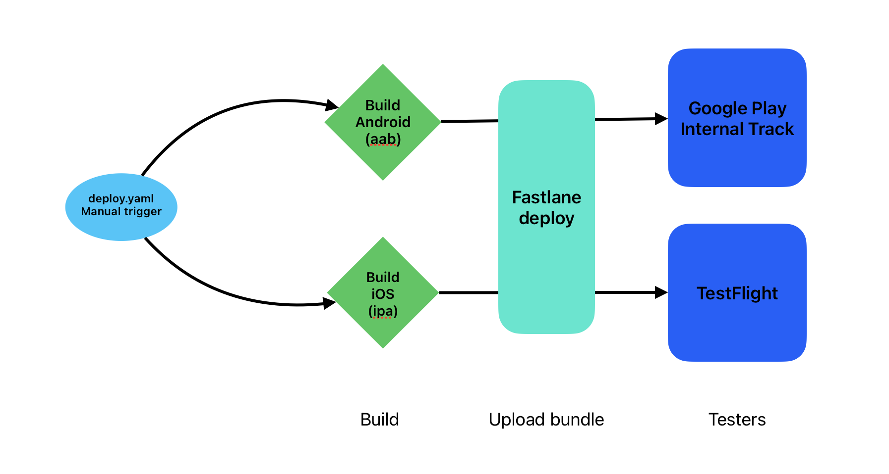
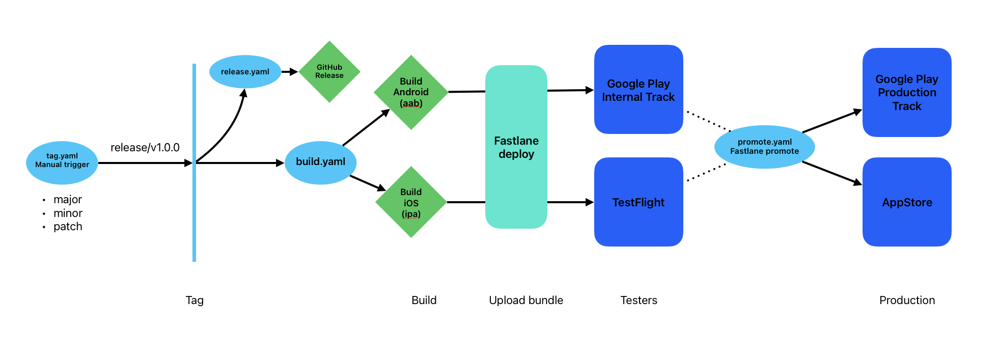

# Flutter CI/CD with Fastlane and GitHub Actions: The Basics (Part 1)


## Introduction

If you're looking to streamline your Flutter app's deployment to the AppStore and PlayStore, you're in the right spot. We'll use Fastlane and GitHub Actions to automate our workflow. By the end of this tutorial, you'll have a automated pipeline that builds and deploys your Flutter app to your preferred App Stores. This guide will skip all the setup and configuration of Fastlane and GitHub Actions, and will focus on the Flutter and Workflow specific parts of the setup.

Repository: [Flutter App CI/CD with Fastlane and GitHub Actions](https://github.com/dario-digregorio/flutter_github_actions)

## Prerequisites

- A Flutter app
- Flavors and Environment Variables set up in your Flutter app. You can follow the [official Flutter guide](https://flutter.dev/docs/deployment/flavors) to set this up.
- You should be able to build a release version for Android and iOS. You can follow the [Android guide](https://flutter.dev/docs/deployment/android) and [iOS guide](https://docs.flutter.dev/deployment/ios) to set this up.
- A GitHub account with your app's repo.
- Fastlane installed on your local machine. You can follow the [official Fastlane installation guide](https://docs.fastlane.tools/getting-started/ios/setup/).
- AppStore and PlayStore accounts ready for deployment with your apps project setup.
- Follow the initial [CD Flutter Guide](https://docs.flutter.dev/deployment/cd#local-setup) to setup the Fastlane folders in your Flutter project.

When you finished all the prerequisites, you should have following project structure with Fastlane folders in both iOS and Android folders:

```
- android
  - fastlane
    - Appfile
    - Fastfile
- ios
  - fastlane
    - Appfile
    - Fastfile
```
> Note: In this guide I will use the basic fastlane commands. It is highly recommended to use Fastlane with `bundle`. Read more about it in the Fastlane documentation
> 
---

## Setting Up The Fastfiles and Environment
Now we will setup the Fastfiles for both iOS and Android. We will define lanes for deploying the app to the AppStore and PlayStore.

### Android

1. Open `android/Gemfile` and add the flutter version plugin which we will need to extract the version from the pubspec.yaml file:

    ```ruby
    # ...
    source "https://rubygems.pkg.github.com/tianhaoz95" do
      gem "fastlane-plugin-flutter_version", "1.1.15"
    end
    ```

2. Open `android/fastlane/Appfile` and define the path to your service account JSON file and the package name of your app:

    ```ruby
    json_key_file("path/to/your/service-account.json")
    package_name("com.example.yourapp")
    ```
    You created the Service Account JSON file in the [CD Flutter Guide](https://docs.flutter.dev/deployment/cd#local-setup). Make sure to exclude the file from your git repository.

3. Open `android/fastlane/Fastfile` and define the `deploy` lane (delete the existing content):
    ```ruby
    default_platform(:android)

    platform :android do
      desc "Deploy a new version to the Google Play"
      lane :deploy do
        version = flutter_version()
        upload_to_play_store(
          track: 'internal', # Can be 'internal', 'alpha', 'beta', 'production'
          skip_upload_metadata: true, # Skip uploading metadata
          skip_upload_images: true, # Skip uploading screenshots
          skip_upload_screenshots: true, # Skip uploading screenshots
          release_status: "completed", # Can be 'draft', 'completed', 'halted'
          aab: '../build/app/outputs/bundle/release/app-release.aab', # Path to your AAB file
          version_code: version["version_code"], # From pubspec.yaml
          version_name: version["version_name"] + version["version_code"],
        )
      end
    end
    ```
    More information about the `upload_to_play_store` action can be found [here](https://docs.fastlane.tools/actions/upload_to_play_store/).
4. Run `bundle install` in the `android` directory to install the required gems.
5. Run `fastlane supply init` to initialize the PlayStore metadata. With this you can update the metadata like app description or screenshots without leaving your IDE. You can skip this step if you don't want to upload metadata. 
6. Build the app with `flutter build appbundle --release` and make sure the AAB file is located in the path you defined in the Fastfile and to use release signing keys. Follow the [Android guide](https://flutter.dev/docs/deployment/android) to set up the release signing.
7. Before deploying your first release you need to have at least one release already uploaded and published manually.
8. Run `fastlane deploy` to start the lane and deploy your app to the PlayStore. 

Depending on your setup, you might need to adjust the `upload_to_play_store` action to match your requirements.

**Google Play Store Release Dashboard**


### iOS

1. Open `ios/Gemfile` and add the flutter version plugin again:

    ```ruby
    # ...
    source "https://rubygems.pkg.github.com/tianhaoz95" do
      gem "fastlane-plugin-flutter_version", "1.1.15"
    end
    ```

2. Open `ios/fastlane/Appfile` and define app identifier, the Apple ID of your Apple Developer account and the Team ID:

    ```ruby
    app_identifier("com.example.yourapp")
    apple_id("test@your.email.com")
    itc_team_id("123456")
    ```


3. Open `ios/fastlane/Fastfile` and define the `deploy` lane (delete the existing content):

    ```ruby
    platform :ios do
      lane :deploy do
        pilot(
          skip_waiting_for_build_processing: true, # Skip waiting so we don't waist precious build time
          changelog: "This build was uploaded using fastlane",
          ipa: "../build/ios/ipa/flutter_github_actions.ipa" # Path to your IPA file
        )
      end
    end
    ```
    More information about [`pilot`](https://docs.fastlane.tools/actions/pilot/) can be found in the Fastlane documentation. Depending on your setup you might need to use actions like [`gym`](https://docs.fastlane.tools/actions/gym/) or [`match`](https://docs.fastlane.tools/actions/match/) to build the IPA file.
4. Run `bundle install` in the `ios` directory to install the required gems.
5. Run `fastlane deliver init` to initialize the AppStore metadata. With this you can update the metadata like app description or screenshots without leaving your IDE. You can skip this step if you don't want to upload metadata.
6. Make sure you have already created an app in AppStore Connect.
7. Depending on the account you use you might need to further authenticate with an app-specific password. See the [Fastlane documentation](https://docs.fastlane.tools/getting-started/ios/authentication/) for more information.
8. Run `fastlane deploy` to start the lane and deploy your app to the AppStore. 

Depending on your setup, you might need to adjust the actions to match your requirements. Consider also to use the actions 

**AppStore TestFlight Builds Dashboard**


### Setting Up GitHub Actions

Now that Fastlane is set up and you successfully run the lanes manually on your local machine, we can automate the deployment process with GitHub Actions.

> Note: To make the guide more simple we will use a self-hosted runner in this guide. You can also use the GitHub hosted runners. Make sure to adjust the paths and the Fastfile accordingly and to also add all necessary tools to the runner.

Now, let's automate these processes with GitHub Actions:

1. In your GitHub repo, create a new directory `.github/workflows`.
2. Create a new file in this directory, e.g. `deploy.yml`.
3. We need to create some secrets. Go to your repository settings and add the following secrets:
    - `STORE_PASSWORD`: The password for your keystore file.
    - `KEY_JKS`: The base64 encoded keystore file.
    - `SEC_JSON`: The base64 encoded service account JSON file.
    - `FASTLANE_APPLE_APPLICATION_SPECIFIC_PASSWORD`: The app-specific password for your Apple Developer account.
  
    To encode the files you can use the following command:
    ```bash
    cat path/to/your/file | openssl base64
    ```
    Copy the output and add it as a secret.
4. Add the following content to the `deploy.yml` file:
    ```yaml
    name: Build and Deploy
    on:
      workflow_dispatch:

    jobs:
      build_android:
        concurrency:
          group: ${{ github.workflow }}-${{ github.ref }}-android
          cancel-in-progress: true
        name: Build and Deploy Android
        runs-on: self-hosted

        steps:
          - uses: actions/checkout@v4
          - uses: actions/setup-java@v3.3.0
            with:
              distribution: "zulu"
              java-version: "17"
          - name: Create Key properties file
            run: |
                cat << EOF > "./android/key.properties"
                storePassword=${{ secrets.STORE_PASSWORD }} 
                keyPassword=${{ secrets.STORE_PASSWORD }}
                keyAlias=upload
                storeFile=./key.jks
                EOF
          - name: Decode key file
            run: echo "${{ secrets.KEY_JKS }}" | openssl base64 -d -out ./android/app/key.jks
          - name: Decode sec json file
            run: echo "${{ secrets.SEC_JSON }}" | openssl base64 -d -out ./android/sec.json
          - uses: subosito/flutter-action@v2
          - run: flutter packages pub get
          - run: flutter build appbundle --release
          - name: Fastlane Action
            uses: maierj/fastlane-action@v2.3.0
            with:
              lane: deploy
              subdirectory: android

      build_ios:
        concurrency:
          group: ${{ github.workflow }}-${{ github.ref }}-ios
          cancel-in-progress: true
        name: Build and Deploy iOS
        runs-on: self-hosted
        env:
          FASTLANE_APPLE_APPLICATION_SPECIFIC_PASSWORD: ${{ secrets.FASTLANE_APPLE_APPLICATION_SPECIFIC_PASSWORD }}

        steps:
        - uses: actions/checkout@v4
        - uses: subosito/flutter-action@v2
        - run: flutter packages pub get
        - run: flutter build ipa --release
        - name: Deploy iOS Beta to TestFlight via Fastlane
          uses: maierj/fastlane-action@v2.3.0
          with:
            lane: deploy
            subdirectory: ios
    ```

    Let me break down what this workflow does. There are two jobs, `build_android` and `build_ios`. Each job builds and deploys the app to the PlayStore and AppStore respectively. The jobs are triggered manually by the `workflow_dispatch` event.
    To build the Android app we need to create the `key.properties` file and decode the keystore and service account JSON file. We then build the app bundle and run the Fastlane action with the `deploy` lane. The iOS job is simpler, we just build the IPA file and run the Fastlane action with the `deploy` lane.

5. Adjust the `flutter-version` as per your project's requirements.
6. Trigger the workflow manually by going to the Actions tab in your GitHub repository and selecting the `Build and Deploy` workflow. Click on the `Run workflow` button and select the branch you want to deploy.
7. Wait and watch the magic happen! ✨ 
   
   

Whenever you want to deploy a new version of your app, simply edit the version in the `pubspec.yaml` and push your changes to the main branch and trigger the workflow manually. The workflow will build and deploy your app to the AppStore and PlayStore automatically.

### Build Number
For some projects it makes sense to use the build number which is currently used on the respective platform. For this there are actions to get the build number from the AppStore and PlayStore. You can use the `app_store_build_number` and `google_play_track_version_codes` actions to get the build number. You can then use this build number to set the version code in the Fastfile.

### Conclusion

And that's it! You've now set up a CI/CD pipeline for your Flutter app using Fastlane and GitHub Actions. This setup will automatically build and deploy your app to the AppStore and PlayStore. Time to kick back, relax, and let automation handle the repetitive tasks.



We are still not done here. The next guide will cover how to automate the versioning, testing and  of your app with Fastlane. Stay tuned! Happy coding! 🚀

### About the Author
#### Dario Digregorio - Senior Flutter Developer
Dario is a passionate and innovative Senior Flutter Developer at [NTT Data](https://de.nttdata.com/) with a keen interest in crafting seamless user experiences using cutting-edge technology. You can find him on [LinkedIn](https://www.linkedin.com/in/dario-digregorio-064696241/) and [GitHub](https://github.com/dario-digregorio).


---
---
---

# Flutter CI/CD with Fastlane and GitHub Actions: Releases (Part 2)


## Introduction

In the previous article, we have seen how to setup Fastlane and GitHub Actions for the example app. In this article, we will see how to automate the release process further with versioning, GitHub Releases and promoting using Fastlane and GitHub Actions.

Repository: [Flutter App CI/CD with Fastlane and GitHub Actions](https://github.com/dario-digregorio/flutter_github_actions)

## Prerequisites
- Follow the first part of the guide to setup Fastlane and GitHub Actions.

## Creating the Tag Workflow

We will create a new workflow that will bump the `pubspec.yaml` version, create a new tag and pushes the changes to the repository.

1. Create a new file in the `.github/workflows` directory, e.g. `tag.yml`.
2. Add the following content to the `tag.yml` file:
    ```yaml
      name: Tag Release
      on:
          workflow_dispatch:
              inputs:
                action:
                  type: choice
                  description: Action type
                  default: none
                  options:
                  - major
                  - minor
                  - patch
                  - none
      jobs:
        tag:
          concurrency:
            group: ${{ github.workflow }}-${{ github.ref }}
            cancel-in-progress: true
          name: Tag
          runs-on: self-hosted
          permissions:
              # Give the default GITHUB_TOKEN write permission to commit and push the
              # added or changed files to the repository.
              contents: write

          steps:
            - uses: actions/checkout@v4
              with:
                  ref: ${{ github.head_ref }}
                  fetch-depth: 0 # Fetch all history for tags and branches
            - uses: stikkyapp/update-pubspec-version@v2
              id: update-pubspec-version
              with:
                  strategy: ${{ github.event.inputs.action }}
                  bump-build: true
            - uses: stefanzweifel/git-auto-commit-action@v5
              with:
                commit_message: "Bump version to ${{ steps.update-pubspec-version.outputs.new-version }}"
                commit_user_name: GitHub Actions
                tagging_message: release/v${{ steps.update-pubspec-version.outputs.new-version }}
      ```
    This workflow can be triggered manually and accepts an input to which action you want to perform. There are four options: `major`, `minor`, `patch` and `none`. Each action will bump the version accordingly. See [this](https://semver.org/) for more information about semantic versioning. We use the `update-pubspec-version` action to bump the version in the `pubspec.yaml` file and the `git-auto-commit-action` to commit the changes and create a new tag with the format `release/v1.0.0`. Each workflow run will always bump the build number.
3. Trigger the workflow manually by going to the Actions tab in your GitHub repository and selecting the `Tag Release` workflow. Click on the `Run workflow` button and select the branch you want to tag.
4. Wait and watch the magic happen! ✨ You should see a new commit and tag in your repository.


## Creating the Release Workflow
1. Create a new file in the `.github/workflows` directory, e.g. `release.yml`.
2. Add the following content to the `release.yml` file:
    ```yaml
    name: Create Release
    on: 
      push:
        tags:
        - 'release/*'

    jobs:
      release:
        concurrency:
          group: ${{ github.workflow }}-${{ github.ref }}-release
          cancel-in-progress: true
        runs-on: self-hosted

        steps:
        - uses: actions/checkout@v4
        - name: Create Release
          uses: ncipollo/release-action@v1
          with:
            name: ${{ github.ref_name }}
            tag: ${{ github.ref }}
            generateReleaseNotes: true
    ```
    This workflow will be triggered whenever a new tag with the format `release/*` is pushed to the repository. The action will create a new release with the tag name and generate the release notes based on the commit messages and merged branches since the last tag.
3. We are not done yet. Triggering the tag workflow won't trigger the release workflow yet. This is because of a restriction of GitHub.  Follow this [guide](https://docs.github.com/en/authentication/keeping-your-account-and-data-secure/managing-your-personal-access-tokens#creating-a-personal-access-token-classic) to create a token with the `repo` scope. Add the token as a secret in your repository with the name `PAT`. Now we need to add the token to the `checkout` action in the `tag.yml` file:
    ```yaml
      # Remove from here 
    permissions:
      # Give the default GITHUB_TOKEN write permission to commit and push the
      # added or changed files to the repository.
      contents: write
      # Until here

    steps:
      - uses: actions/checkout@v4
        with:
            ref: ${{ github.head_ref }}
            fetch-depth: 0 # Fetch all history for tags and branches
            token: ${{ secrets.PAT }}
    ```
    Since the `checkout` action uses the `GITHUB_TOKEN` by default, we need to add the `PAT` token to the action to trigger the release workflow. We then can remove the `permissions` part. It is better to trigger the workflow only manually otherwise the workflow will run a loop.
4. Now trigger again the Tag workflow and you should see a new release in your repository after the `Release Workflow` finished successfully.
   
5. To trigger the `Build and Deploy` workflow whenever a new tag is created. Add this to the `deploy.yml` file:
    ```yaml
      on:
        workflow_dispatch:
        push:
          tags:
            - 'release/*'
    ```
    This will trigger the `Build and Deploy` workflow whenever the `Tag Workflow` creates a new tag. This way you can automate the whole process from versioning to deployment.

## Creating the Promote Workflow
The idea is to have a workflow that will promote a release to a specific track in the PlayStore. This can be useful if you want to promote a release from the internal track to the production track or from TestFlight to the AppStore for example.
   1. Add this lane to the `android/fastlane/Fastfile`:
      ```ruby
        platform :android do
            # ...
            desc "Promote version"
            lane :promote do |options|
              skip = options[:skip] || true
              version = flutter_version()
              upload_to_play_store(
                track: "internal",
                track_promote_to: "production",
                skip_upload_metadata: false,
                skip_upload_images: skip,
                skip_upload_screenshots: skip,
                track_promote_release_status: "draft",
                version_code: version["version_code"],
                version_name: version["version_name"],
              )
          end
        end
      ```
      Add this lane to the `ios/fastlane/Fastfile`:
      ```ruby
        platform :ios do
          # ...
          desc "Promote version"
          lane :promote do |options|
            skip = options[:skip] || true
            version = flutter_version()
            deliver(
              submit_for_review: false,
              automatic_release: true,
              force: true,
              skip_screenshots: skip,
              skip_binary_upload: true,
              overwrite_screenshots: true,
              app_version: version["version_name"],
              precheck_include_in_app_purchases: false
            )
          end
        end
      ```
      We added a promote lane both for Android and iOS. The lane will promote the release from the internal track or TestFlight to the production track in the PlayStore and AppStore respectively. We also added an option to skip the screenshots upload.

 1. Before you can promote a release you need to have at least one release already uploaded and published manually. Make sure to have a release in the production track in the PlayStore and the app published in the AppStore.
 2. Run `fastlane promote skip:true` to start the lane and promote your the version to the respective track. Make sure to run the command in the respective platform folder.
 3. After you successfully promoted the release you can now automate this process with GitHub Actions.
 4. Create a new file in the `.github/workflows` directory, e.g. `promote.yml`.
 5. Paste this content into the `promote.yml` file:
    ```yaml
    name: Promote Release
    on:
      workflow_dispatch:
        inputs:
          skip:
            type: boolean
            description: skip screenshots
            default: true

    jobs:
      android:
        concurrency:
          group: ${{ github.workflow }}-${{ github.ref }}-android
          cancel-in-progress: true
        name: Promote Android
        runs-on: self-hosted

        steps:
          - uses: actions/checkout@v4
          - name: Decode sec json file
            run: echo "${{ secrets.SEC_JSON }}" | openssl base64 -d -out ./android/sec.json
          - name: Promote Release on Play Store
            uses: maierj/fastlane-action@v2.3.0
            with:
              subdirectory: android
              lane: promote

      ios:
        concurrency:
          group: ${{ github.workflow }}-${{ github.ref }}-ios
          cancel-in-progress: true
        name: Promote iOS
        runs-on: self-hosted
        env:
            FASTLANE_APPLE_APPLICATION_SPECIFIC_PASSWORD: ${{ secrets.FASTLANE_APPLE_APPLICATION_SPECIFIC_PASSWORD }}
        steps:
          - uses: actions/checkout@v4
          - name: Promote Release on App Store
            uses: maierj/fastlane-action@v2.3.0
            with:
              subdirectory: ios
              lane: promote skip:${{ github.event.inputs.skip }}
    ```
    This workflow can be triggered manually and accepts an input if you also want to upload screenshots. The workflow will take a release and promote it to the respective track in the PlayStore or AppStore.
  6. Trigger the workflow manually by going to the Actions tab in your GitHub repository and selecting the `Promote Release` workflow. Click on the `Run workflow` button and select the branch or tag you want to promote. Make sure the version you want to promote is already uploaded and published in the respective track. You can do that with the `deploy` workflow.

## Recap



So how does the whole process look like now? Whenever you want to release a new version of your app, you can trigger the `Tag Release` workflow manually. You can choose between `major`, `minor` and `patch`. The workflow will bump the version in the `pubspec.yaml` file, create a new commit and tag and push the changes to the repository. This will trigger the `Release Workflow` which will create a new release with the tag name and the generated release notes. This will also trigger the `Build and Deploy` workflow which will build and deploy the app to the AppStore and PlayStore. After you successfully deployed the app you can trigger the `Promote Release` workflow manually. This will promote the release to the respective track in the PlayStore and AppStore.

## Conclusion

And that's it! You've now set up a CI/CD pipeline for your Flutter app using Fastlane and GitHub Actions. This setup will automatically build and deploy your app to the AppStore and PlayStore. You've also automated the versioning, tagging and releasing process with GitHub Actions. Time to kick back, relax, and let automation handle the repetitive tasks.

### About the Author
#### Dario Digregorio - Senior Flutter Developer
Dario is a passionate and innovative Senior Flutter Developer at [NTT Data](https://de.nttdata.com/) with a keen interest in crafting seamless user experiences using cutting-edge technology. You can find him on [LinkedIn](https://www.linkedin.com/in/dario-digregorio-064696241/) and [GitHub](https://github.com/dario-digregorio).